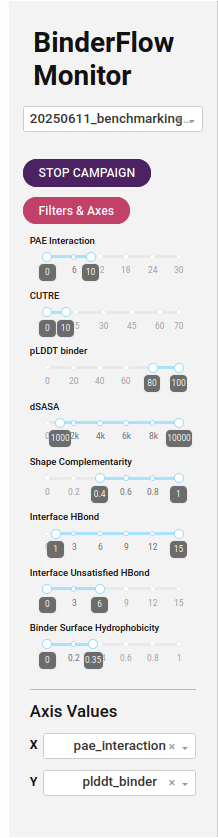
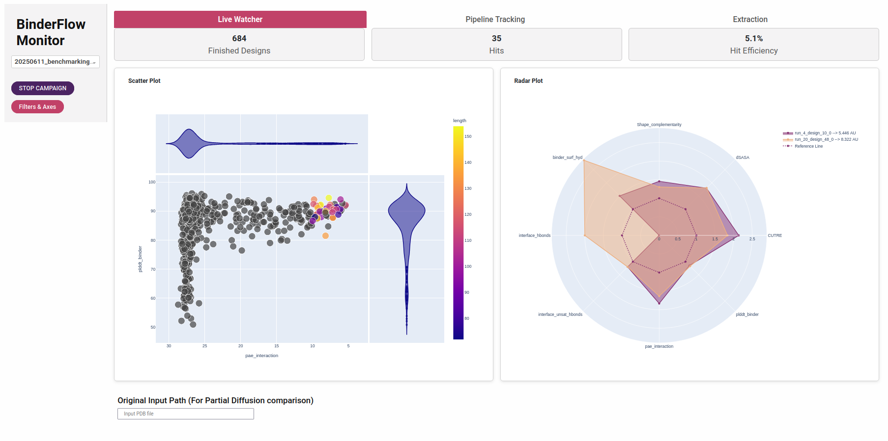
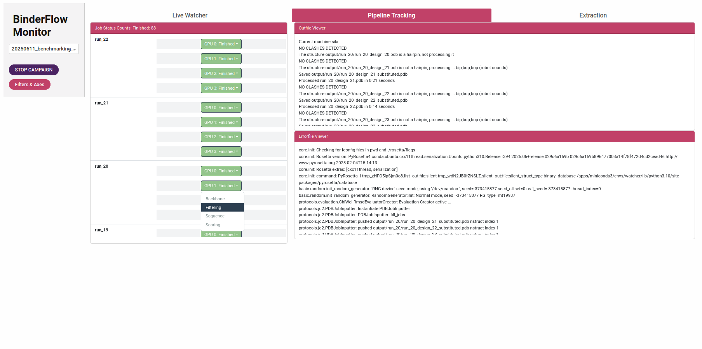
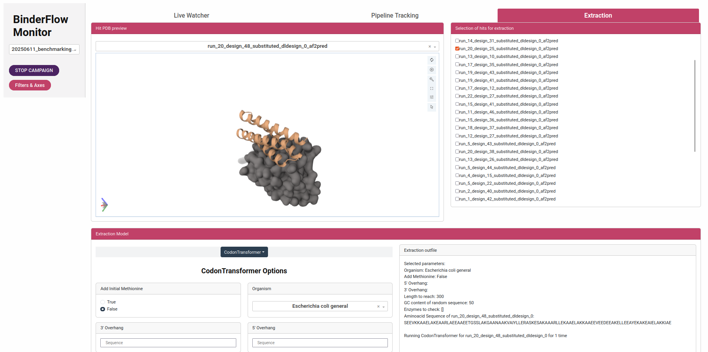

# BFmonitor

BFmonitor is a web-based dashboard that includes tools to monitor campaigns, evaluate designs, and select hits for DNA synthesis.

## Setting BFmonitor

To run BFmonitor, you just have to [install](../README.md) the environment by running `install_binderflow.sh`.

BFmonitor automatically reads all the subdirectories (from the parent directory you are running the script) that have an structure compatible with BinderFlow and allows to select them for display. 

## Running BFmonitor

After running BinderFlow, you can go to that directory and run:

```bash
python3 /path/to/BFmonitor.py --port 8050
```

This will print a link in the screen you can follow to access the dashboard.

## BFmonitor in detail

As mentioned before, BFmonitor is web-based dashboard that includes tools to monitor campaigns, evaluate designs and select hits for DNA synthesis. It is composed of a left sidebar and three tabs 

### Sidebar

<table>
<tr>
<td style="width:50%; vertical-align:top;">

On the sidebar we have three different elements. First a dropdown to select the BinderFlow campaing. Then there is a button which stops that campaign. Finally, there is a set of slideranges we can modify to filter which of the designs from the campaign are selected as hits. These metrics include:

- *pLDDT_binder*: How confident is AF about the binder folding. Recommended over 80  
- *PAE_interaction*: How confident is AF about the binder and target relative positions. Recommended below 10.  
- *CUTRE*: This is the PAE_interaction, filtered using only the interface residues and weighted by the pLDDT of the interface residues. Recommended below 10.  
- *dG*: Free energy of the interface. To be considered good, these values should be negative, but none of the hits designs have good dG. Recommended to be lower than 0.  
- *dSASA* : Solvent accessible surface area which is ocluded by the binding. Larger values means a larger binding interface, we use 1000 as threshold but for smaller interfaces other values can be used.  
- *dG/dSASA ratio*: Normalised binding energy by the binding interface surface  
- *Shape_complementarity*: How well the binder and target structure fit. It goes from 0 to 1, anything above 0.50 is considered sufficient and above 0.8 is considered a good shape match  
- *Packstat*: This stat is used to measure the cavity holes inside a protein structure. Real structures tend to avoid these holes, and thus their score is large (close to 1). Moreover, the [authors](https://onlinelibrary.wiley.com/doi/10.1002/pro.8) find out a correlation between a X-Ray structure resolution and its Packstat metric. Above 0.65 is good.  
- *SAP_score*: Surface Aggregation Propensity, a measurement of how prone to aggregation is a protein. Pyrosetta Doc isn't very understandable, but I think it relates to the Developability Index. Below 10 means high stability, between 10 and 20 medium stability.  
- *binder_int_hyd*: Binder Interface Hydrophobicity. Measures from 0 to 1 the proportion of hydrophobic residues present in the binder interface (only binder proportion).  
- *binder_surf_hy*: Binder Surface Hydrophobicity. Measures from 0 to 1 the proportion of hydrophobic residues present on the binder's surface. Recommended to be lower than 0.35.  
- *interface_hbonds*: Number of hydrogen bonds at the interface. Recommended larger than 3.  
- *interface_unsat_hbonds*: Number of unsatisfied buried hydrogen bonds at the interface. Recommended to be lower than 4.  
- *RMSD*: RMSD between the design by RFD and the prediction by AF2. Values below 2 Å are probably accurate enough, although there is no data about where to put the threshold.  
- *ipSAE*: Metric developed by Dunbrack and explained [here](https://www.biorxiv.org/content/10.1101/2025.02.10.637595v1.full.pdf). Although more extensive studies should be made, anything over 0.6 probably can be considered a true positive.  

Most of these filters are based on the ones published by Martin Pacesa for BindCraft. Thank you! (Highly recommend checking their work!)  

On the bottom of the sidebars we can access which metrics are plotted in the X and Y axis of the scatterplot.  

</td>
<td style="width:50%; vertical-align:top;">



</td>
</tr>
</table>

### Live Watcher

Interactive graphical summary of the design campaign. In it, the user can set thresholds for all parameters calculated by AF2IG and PyRosetta to define when binders are considered hits and filter them. It contains a scatter plot, in which any pair of these parameters can be represented, providing an overview of the project and identifying correlations between them. It also includes a radar plot for pairwise comparisons of designs, showing all calculated parameters normalised by the value set for the mentioned thresholds.



### Pipeline Tracking

Details the progress of each BinderFlow instance. It informs about the current state of each instance, and allows to access the logfiles of the campaign.



### Extraction

Allows the user to preview the structure of the binder-target complex for any design that passes the thresholds. Moreover, the user can extract the hits structures as .pdb files and their sequences in .fasta format. In addition, we include a reverse translation tool based on [CodonTransformer](https://github.com/adibvafa/CodonTransformer), which returns DNA coding sequences for the selected binders. These can be flanked by custom 5’ and 3’ sequences to facilitate cloning and downstream applications, and can be directly used for DNA synthesis orders.



