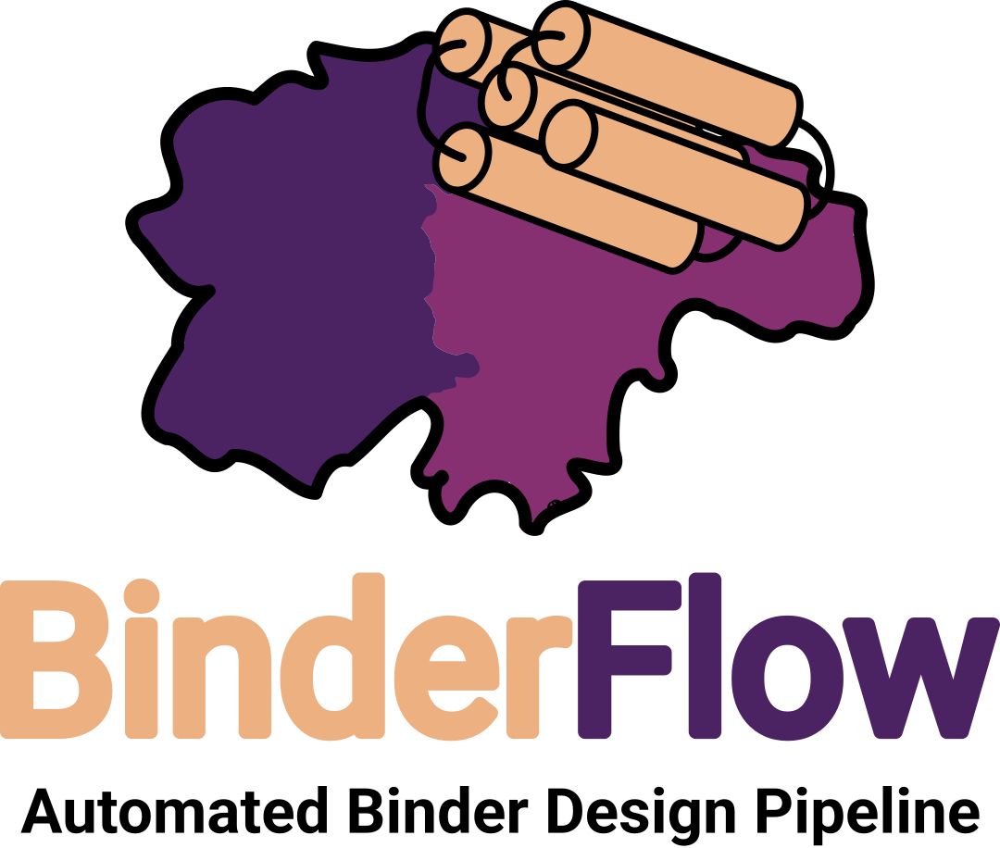

<div align="center">
  <div>&nbsp;</div>
  
</div>

 [GitHub documentation in progress, please be patient]


## Introduction

BinderFlow provides a protein binder design platform for SLURM-based computer infrastructure users. BinderFlow eases the process for non-experts, while also providing new functionalities for people already working in protein design.

This repo is divided into two main tools: **binderflow.sh** a script to perform batch-based protein binder design, and **BFmonitor.py** a webapp that allows monitoring of the campaign, filtering of designs and streamlines future steps such as DNA synthesis


## Installation

1.Clone this repository

```shell
git clone https://github.com/cryoEM-CNIO/BinderFlow [install_folder]`
```

Where install_folder is the path where you want to install it.

`Note: Be sure that the path is accessible for the computer infrastructure where you are going to run the scripts`

2.For the **binderflow.sh** script,you have to install [RFD](https://github.com/RosettaCommons/RFdiffusion) and a fork version of [dl_binder_design](https://github.com/CarlosChacon-cell/dl_binder_design) (needed to solve some performance issues). The installation is detailed in the respective GitHubs

3.Run the following script from the cloned repository folder:

```shell
bash install_binderflow.sh --pkg_manager PKG_MANAGER 
```

Where PKG_MANAGER is whether conda or mamba (the default and the one we use is conda)

`As with RFD, this installs PyRosetta, which requires a license for commercial purposes.`

4.After cloning the repository and installing the environment, you have to set all your local information in **config.sh** (Paths to the RFD, pMPNN and AF2IG directory, environments names and slurm configuration).  

## BinderFlow

BinderFlow is a pipeline for protein binder design. It subdivides protein design projects, which are often run linearlly, into several batches of user-determined size, running sequentially backbone generation, design filtering, sequence assignment, and candidate scoring. The batch nature of the workflow enables live monitoring of the campaign, seamless coexistence with other GPU intensive process and reduces human intervention.

You can start designing protein binders against a selected target using BinderFlow by running:

```bash
nohup /path/to/binderflow.sh --json /path/to/input.json > project_name.log 2>&1 &
```

To get complete information about BinderFlow designing options and initial settings go to the [design instructions](./binderflow/BinderFlow.md) and, in the future, check the [technical report]() 

## BFmonitor

BFmonitor is a web-based dashboard that includes tools to monitor campaigns, evaluate designs, and select hits for DNA synthesis. It is subdivided into three different tabs:
- Live Watcher: See design metrics in a scatterplot, apply filters and make pairwise comparisons between designs
- Pipeline Tracking: Check the current state of each batch, and the log files from each of the process
- Extraction: Visualize the structures of the designs, select hits, and extract the pdbs, fasta and DNA sequence for ordering

To get complete information about BFmonitor, go to the [monitoring instructions](./BFmonitor/BFmonitor.md)

